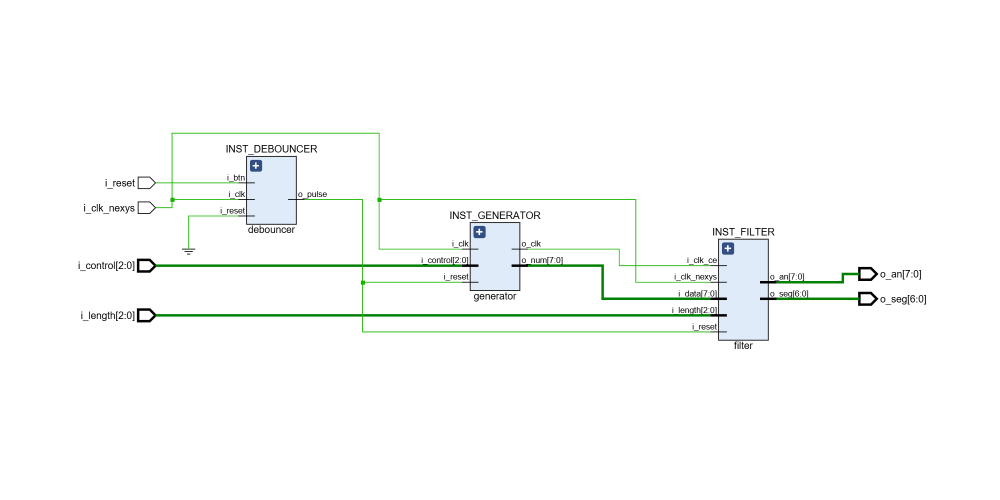
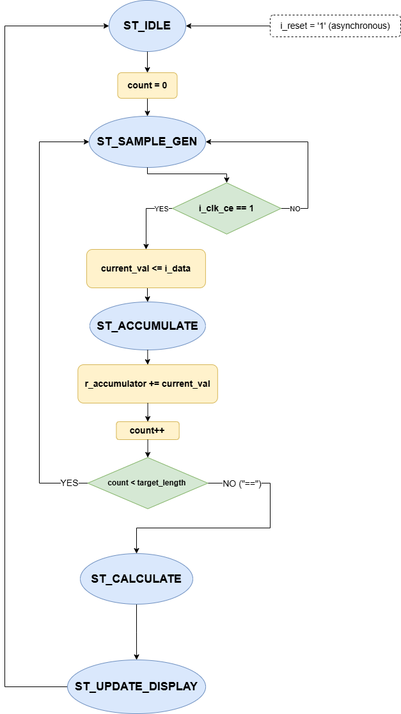

# VHDL Digital Averaging Unit  
# Technical Description  
VHDL implementation of a high-performance, configurable Digital Moving Average Filter designed for real-time FPGA signal processing.  
The system utilizes a strictly synchronous architecture to calculate the arithmetic mean of an 8-bit data stream (0-255) generated internally through multiple operational modes.
By employing a modular RTL approach, the design separates the `Data Generation (Control Unit)` from the `Filtering Logic (Execution Unit)`, ensuring high frequency stability and resource efficiency on Artix-7 hardware.  

# Architecture
The architecture is built upon a **Synchronous Clock Enable (CE)** strategy, transitioning away from unstable gated-clock designs to a production-grade 100MHz system clock domain.  
It integrates advanced input conditioning, including a debounced master reset and a **Linear Feedback Shift Register (LFSR)** for pseudo-random data injection. The execution pipeline features a 12-bit accumulator, a bit-shifting arithmetic unit for division-free averaging, and a Binary-to-BCD conversion core for multiplexed 7-segment visualization.  

# Objectives
The primary objective was to engineer a robust, synthesis-optimized DSP unit capable of:  
* **Configurable Window Filtering:** Dynamically selecting averaging lengths for 2, 4, 8, or 16 samples via hardware switch inputs.  
* **Multi-Mode Signal Generation:** Implementing a custom Data Generator supporting Square Wave, Pseudo-Random (LFSR), and Static Test patterns.  
* **Deterministic Timing:** Utilizing a Clock Enable architecture to maintain phase alignment across all internal modules at 100MHz.  
* **Hardware-Efficient Arithmetic:** Implementing the moving average algorithm using bit-shift logic to eliminate the need for resource-heavy division IP cores.  
* **BCD-to-SSD Pipeline:** Real-time conversion and multiplexing of 8-bit results for 8-digit 7-segment displays.  

# FSM Logic
The system's control flow is managed by a deterministic Finite State Machine (FSM) to ensure data integrity during the sampling and accumulation phases:  
**1. Averaging Controller FSM** 
Coordinates the lifecycle of a calculation sequence, from initial reset to display update.  
**2. Operational States:**
* **ST_IDLE:** Global register initialization and count reset.  
* **ST_SAMPLE_GEN:** Synchronous capture of input data triggered by the `i_clk_ce` pulse.  
* **ST_ACCUMULATE:** Sequential summation of $2^n$ samples into the high-precision accumulator.  
* **ST_CALCULATE:** Execution of bitwise right-shift operations to derive the final mean.  
* **ST_UPDATE_DISPLAY:** Latching the result into the BCD-to-SSD controller for persistent visualization.

  

# Skills  
This project demonstrates proficiency in:  
**→ RTL Design and modular VHDL architecture for Nexys A7 (Artix-7) FPGAs.**  
**→ Digital Signal Processing (DSP) fundamentals implemented directly in hardware.**   
**→ Synchronous design techniques and Clock Enable (CE) frequency scaling.**  
**→ Linear Feedback Shift Register (LFSR) design for pseudo-random sequence generation.**   
**→ Binary-to-BCD conversion and 7-segment multiplexing logic.**  
**→ Advanced Verification & Validation (V&V) using self-checking testbenches in Vivado.**  

# Testing  
The design was synthesized and implemented using the `Xilinx Vivado™ Design Suite` for the `Nexys A7-100T` board. Simulation in `Vivado Simulator` confirmed:  
* **Mathematical Accuracy:** Filter output matches calculated arithmetic mean across all window sizes (2, 4, 8, 16).  
* **Timing Closure:** The design meets all setup and hold requirements at 100MHz with positive slack.  
* **Synchronous Stability:** Zero glitches observed during transition between generator modes and filter lengths.

# Key Technologies
`VHDL`, `Artix-7 (Nexys A7)`, `Xilinx Vivado`, `RTL Design`, `DSP`, `LFSR`, `Finite State Machines (FSM)`, `Digital Logic Synthesis`.

